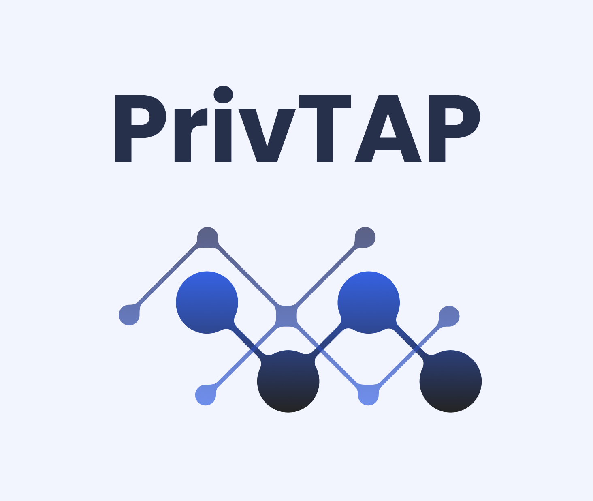

<a name="readme-top"></a>

<!-- PROJECT SHIELDS -->
<!--
*** I'm using markdown "reference style" links for readability.
*** Reference links are enclosed in brackets [ ] instead of parentheses ( ).
*** See the bottom of this document for the declaration of the reference variables
*** for contributors-url, forks-url, etc.
-->
[![Contributors][contributors-shield]][contributors-url]
[![Forks][forks-shield]][forks-url]
[![Stargazers][stars-shield]][stars-url]
[![Issues][issues-shield]][issues-url]
[![MIT License][license-shield]][license-url]


<!-- PROJECT LOGO -->
<br />
<div align="center">
  <a href="https://github.com/privtap/privtap">
    
  </a>

  <h3>PrivTAP</h3>

  <p align="center">
    A Trigger-Action Platform where privacy comes first!
    <br />
    <!-- <a href="https://github.com/privtap/privtap"><strong>Explore the docs »</strong></a>
    <br /> -->
    <br />
    <a href="https://privtap.it">View Demo</a>
    ·
    <a href="https://github.com/privtap/privtap/issues">Report Bug</a>
    ·
    <a href="https://github.com/privtap/privtap/issues">Request Feature</a>
  </p>
</div>


<!-- TABLE OF CONTENTS -->
<details>
  <summary>Table of Contents</summary>
  <ol>
    <li>
      <a href="#about-the-project">About The Project</a>
      <ul>
        <li><a href="#built-with">Built With</a></li>
      </ul>
    </li>
    <li>
      <a href="#getting-started">Getting Started</a>
      <ul>
        <li><a href="#prerequisites">Prerequisites</a></li>
        <li><a href="#installation">Installation</a></li>
      </ul>
    </li>
    <li><a href="#usage">Usage</a></li>
    <!-- <li><a href="#roadmap">Roadmap</a></li>
    <li><a href="#contributing">Contributing</a></li> -->
    <li><a href="#license">License</a></li>
    <li><a href="#contact">Contact</a></li>
    <li><a href="#acknowledgments">Acknowledgments</a></li>
  </ol>
</details>


<!-- ABOUT THE PROJECT -->
## About The Project
[![PrivTAP Screen Shot][product-screenshot]](https://privtap.it)

PrivTAP is a **Trigger-Action Platform** built around the key concepts of **privacy** and user control over its personal data.
On this platform users can configure **automation rules** in the format: IF &lt;trigger&gt; THEN &lt;action&gt;.
Triggers and actions are provided by third-party services, that can offer personalized operations to users thanks to OAuth2 authorization.
Users have **granular control** on what personal data the platform can access.

<p align="right">(<a href="#readme-top">back to top</a>)</p>

### Built With
* [![Node][Node]][Node-url]
* [![Vue][Vue]][Vue-url]
* [![Vite][Vite]][Vite-url]
* [![Tailwind][Tailwind]][Tailwind-url]
* [![Express][Express]][Express-url]
* [![MongoDB][MongoDB]][MongoDB-url]

<p align="right">(<a href="#readme-top">back to top</a>)</p>


<!-- GETTING STARTED -->
## Getting Started

### Prerequisites
* [Node & NPM][Node-url]
* [MongoDB][MongoDB-url]

### Installation
1. Clone the repo
   ```sh
   git clone https://github.com/privtap/privtap.git
   ```
2. Build frontend Single Page Application
   ```sh
   cd <path_to_cloned_repo>/frontend/
   npm install
   npm run build
   ```
3. Build backend Express appserver (two options)
   * Local Express appserver
     ```sh
     cd <path_to_cloned_repo>/backend/
     npm install
     npm run build
     ```
   * Docker container
     ```sh
     cd <path_to_cloned_repo>/backend/
     docker build . -t privtap/backend
     ```

<p align="right">(<a href="#readme-top">back to top</a>)</p>


<!-- USAGE EXAMPLES -->
## Usage
You must set several environment variables in order to execute the backend, any variable that does not have a default
is mandatory:

| Environment variable | Description                                                                                                                        | Default   |
|----------------------|------------------------------------------------------------------------------------------------------------------------------------|-----------|
| PORT                 | the port for the appserver to listen on                                                                                            | 3000      |
| BASE_URL             | the base URL from which the routes will start                                                                                      | /         |
| EXPRESS_STATIC_FILES | path to a folder from which the appserver will serve static files, if this is undefined, the appserver will not serve static files | undefined |
| NODE_ENV             | either `development` or `production`, control various debug feature                                                                |           |
| EMAIL_USER           | username for the mail server (not needed if `NODE_ENV=development`)                                                                |           |
| EMAIL_PASSWORD       | password for the mail server (not needed if `NODE_ENV=development`)                                                                |           |
| DB_STRING            | connection string for a MongoDB database                                                                                           |           |
| JWT_SECRET           | secret used to encrypt JWT tokens                                                                                                  |           |
| JWT_EXPIRE           | expiration time for JWT tokens (in seconds)                                                                                        |           |

The variables can be set in a `.env` file located in the `backend/` folder.

The simplest way to start a local development environment is by running the `run_dev.sh` script.
This will start a local Express appserver that serves both the REST API (at `http://127.0.0.1:<PORT>/api/`) of the 
backend and the Single Page Application of the frontend (at `http://127.0.0.1:<PORT>/`).
Otherwise, you can build the frontend and the backend separately and deploy them as you like.

<p align="right">(<a href="#readme-top">back to top</a>)</p>


<!-- ROADMAP -->
<!-- ## Roadmap

- [ ] Feature 1
- [ ] Feature 2
- [ ] Feature 3
  - [ ] Nested Feature

See the [open issues](https://github.com/privtap/privtap/issues) for a full list of proposed features (and known issues).

<p align="right">(<a href="#readme-top">back to top</a>)</p> -->


<!-- CONTRIBUTING -->
<!-- ## Contributing

Contributions are what make the open source community such an amazing place to learn, inspire, and create. Any contributions you make are **greatly appreciated**.

If you have a suggestion that would make this better, please fork the repo and create a pull request. You can also simply open an issue with the tag "enhancement".
Don't forget to give the project a star! Thanks again!

1. Fork the Project
2. Create your Feature Branch (`git checkout -b feature/AmazingFeature`)
3. Commit your Changes (`git commit -m 'Add some AmazingFeature'`)
4. Push to the Branch (`git push origin feature/AmazingFeature`)
5. Open a Pull Request

<p align="right">(<a href="#readme-top">back to top</a>)</p> -->


<!-- LICENSE -->
## License

Distributed under the GPL-2.0 License. See `LICENSE.txt` for more information.

<p align="right">(<a href="#readme-top">back to top</a>)</p>


<!-- CONTACT -->
## Contact

Email: [contact@privtap.it](mailto:contact@privtap.it)

GitHub: [https://github.com/privtap/privtap](https://github.com/privtap/privtap)

<p align="right">(<a href="#readme-top">back to top</a>)</p>


<!-- ACKNOWLEDGMENTS -->
## Acknowledgments
Thanks to all team members that have worked on this project:
* [Alessandro Sassi](https://github.com/AleSassi)
* [Emanuele Santoro](https://github.com/emanuelesantoro)
* [Enna Basic](https://github.com/ennnnnna)
* [Ivan Radonjic](https://github.com/Chaser222)
* [Michele Benedetti](https://github.com/Michele-x98)
* [Leonardo Panseri](https://github.com/leonardo-panseri)
* [Lorenzo Vaccarini](https://github.com/Vaccarini-Lorenzo)

<p align="right">(<a href="#readme-top">back to top</a>)</p>


<!-- MARKDOWN LINKS & IMAGES -->
<!-- https://www.markdownguide.org/basic-syntax/#reference-style-links -->
[contributors-shield]: https://img.shields.io/github/contributors/privtap/privtap.svg?style=for-the-badge
[contributors-url]: https://github.com/privtap/privtap/graphs/contributors
[forks-shield]: https://img.shields.io/github/forks/privtap/privtap.svg?style=for-the-badge
[forks-url]: https://github.com/privtap/privtap/network/members
[stars-shield]: https://img.shields.io/github/stars/privtap/privtap.svg?style=for-the-badge
[stars-url]: https://github.com/privtap/privtap/stargazers
[issues-shield]: https://img.shields.io/github/issues/privtap/privtap.svg?style=for-the-badge
[issues-url]: https://github.com/privtap/privtap/issues
[license-shield]: https://img.shields.io/github/license/privtap/privtap.svg?style=for-the-badge
[license-url]: https://github.com/privtap/privtap/blob/master/LICENSE.txt

[product-screenshot]: images/screenshot.png

[Node]:  https://img.shields.io/badge/Node.js-35495E?style=for-the-badge&logo=nodedotjs
[Node-url]: https://nodejs.org/
[Vue]: https://img.shields.io/badge/Vue.js-35495E?style=for-the-badge&logo=vuedotjs
[Vue-url]: https://vuejs.org/
[Vite]: https://img.shields.io/badge/Vite-35495E?style=for-the-badge&logo=vite
[Vite-url]: https://vitejs.dev/
[Tailwind]: https://img.shields.io/badge/Tailwind-35495E?style=for-the-badge&logo=tailwindcss
[Tailwind-url]: https://tailwindcss.com/
[Express]: https://img.shields.io/badge/Express-35495E?style=for-the-badge&logo=express
[Express-url]: https://expressjs.com/
[MongoDB]: https://img.shields.io/badge/MongoDB-35495E?style=for-the-badge&logo=mongodb
[MongoDB-url]: https://www.mongodb.com/